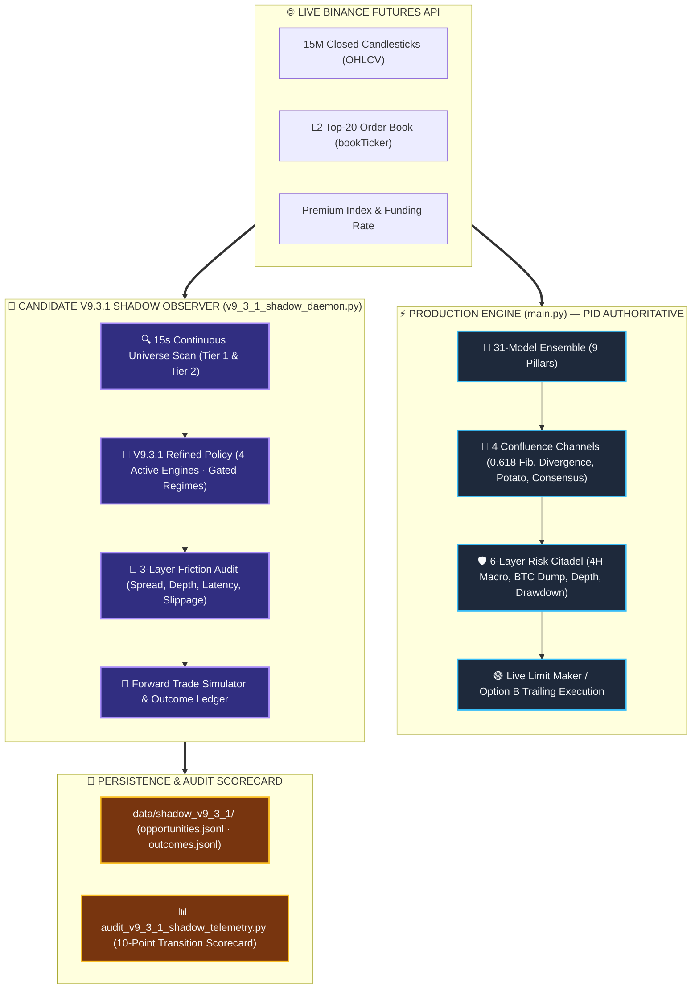
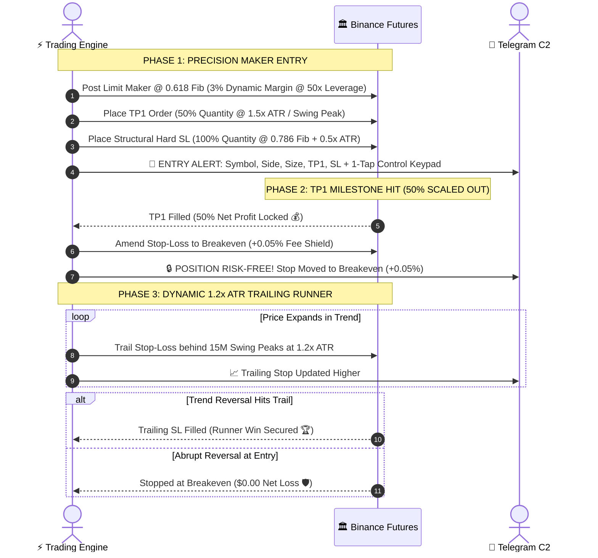

<div align="center">

# ⚡ WEATHER-ENSEMBLE QUANT V2 & CANDIDATE V9.3.1 SHADOW LAYER
### 🌪️ Autonomous Quantitative Consensus, 0.618 Fib Execution & Live Forward Telemetry Citadel

```
╔══════════════════════════════════════════════════════════════════════════════════════════════════════════════╗
║  📊 31 QUANT MODELS  ║  🏛️ 9 PILLARS  ║  📐 0.618 FIB POCKET  ║  🛡️ 6-TIER RISK  ║  📡 V9.3.1 SHADOW DAEMON  ║
╚══════════════════════════════════════════════════════════════════════════════════════════════════════════════╝
```

[](https://python.org)
[](https://binance.com)
[](#-candidate-v931-shadow-telemetry--observer-layer)
[](#-3-layer-execution-audit--friction-telemetry)
[](#-1-click-laptop-deployment--watchdog-suite)
[](#-247-windows-watchdog--daemon)
[](#-mobile-command--control-telegram-c2)

---

### 💡 *The Dual-Engine Architectural Philosophy*
> *Production capital requires absolute protection: live execution is governed by the battle-tested 31-model consensus and 6-layer risk citadel in `main.py`. Simultaneously, candidate strategies (V9.3.1) run in an isolated, read-only shadow observer daemon, ingesting live order flow, bid/ask depth, spread, and funding friction to validate statistical robustness before any live capital allocation.*

</div>

---

## 📑 Master Navigation Index

```
 ┌───────────────────────────────────────┬───────────────────────────────────────┬───────────────────────────────────────┐
 │ 🗺️ Master Dual-Engine Architecture    │ 📡 V9.3.1 Shadow Observer Daemon      │ 🔬 3-Layer Execution Audit Gate       │
 ├───────────────────────────────────────┼───────────────────────────────────────┼───────────────────────────────────────┤
 │ 💻 1-Click Laptop & Watchdog Suite    │ 🤖 31-Model Quantitative Matrix       │ 🎯 4 Signal Confluence Channels       │
 ├───────────────────────────────────────┼───────────────────────────────────────┼───────────────────────────────────────┤
 │ 🌊 Option B Position Lifecycle        │ 🛡️ 6-Layer Institutional Citadel      │ 🪙 11-Asset Alpha Universe            │
 ├───────────────────────────────────────┼───────────────────────────────────────┼───────────────────────────────────────┤
 │ 📊 2-Year Full Backtest Scorecard     │ 📱 Telegram Mobile C2                 │ 🚀 Comprehensive CLI & Quickstart     │
 └───────────────────────────────────────┴───────────────────────────────────────┴───────────────────────────────────────┘
```

---

## 🗺️ Master Dual-Engine Architecture



---

## 📡 Candidate V9.3.1 Shadow Telemetry & Observer Layer

The repository hosts the **V9.3.1 Candidate Strategy**, an institutional 15-minute quantitative model operating in **strict observer mode** alongside the live production bot.

### Key Tenets:
1. **Zero Execution Risk**: Read-only consumption of public Binance Futures data (`/fapi/v1/klines`, `/fapi/v1/ticker/bookTicker`, `/fapi/v1/premiumIndex`). Zero private keys or trading credentials required for the shadow observer.
2. **Production Authoritative Isolation**: `main.py` remains 100% authoritative over live account balance, margin, and order execution.
3. **Realistic Market Friction Recording**: Ingests real-time top-of-book bid/ask spreads, order-book depth imbalance, funding drag, and API roundtrip latency at the exact millisecond of signal generation.

### 📐 V9.3.1 Refined Policy Matrix

```
┌────────────────────────────────────────────────────────────────────────────────────────────────────────┐
│ 🎯 4 ACTIVE HIGH-ALPHA SETUP ENGINES                                                                   │
├──────────────────────────┬──────────────┬──────────────────────────────────────────────────────────────┤
│ Engine                   │ Target R:R   │ Strategic Function                                           │
├──────────────────────────┼──────────────┼──────────────────────────────────────────────────────────────┤
│ 🚀 TREND_CONTINUATION    │ 2.50x ATR    │ Primary alpha driver; captures sustained directional trend   │
│ 💥 BB_ATR_EXPANSION      │ 2.00x ATR    │ Secondary momentum breakout from contracted volatility bands │
│ 🔄 MSS_SHIFT             │ 1.50x ATR    │ Market Structure Shift; liquidity anchor and trend turn      │
│ 🎯 BREAKOUT_RETEST       │ 1.80x ATR    │ High-precision retest of reclaimed price levels              │
├──────────────────────────┴──────────────┴──────────────────────────────────────────────────────────────┤
│ 🚫 6 PRUNED / DISABLED ENGINES (Eliminated based on empirical leave-one-out testing drag)             │
│   • VWAP_TREND (Pruned: -2.17 R drag)              • PULLBACK_CONTINUATION (Pruned: Persistent fee drag)│
│   • LIQUIDITY_SWEEP (Pruned: Whipsaw reclaims)     • EXHAUSTION_REVERSAL (Pruned: High knife-catch rate)│
│   • VWAP_REVERSION (Pruned)                        • FIB_OTE (Pruned: Redundant with primary anchors)   │
├────────────────────────────────────────────────────────────────────────────────────────────────────────┤
│ 🛡️ REGIME GATING POLICY                                                                               │
│   • ✅ ALLOWED: STRONG_TREND, HIGH_VOL, MILD_TREND                                                      │
│   • ⛔ GATED (BLOCKED): RANGE, CHOP, BREAKDOWN (Blocked -100 R cumulative historical drag)             │
├────────────────────────────────────────────────────────────────────────────────────────────────────────┤
│ 🪙 MONITORED UNIVERSE TIERS                                                                           │
│   • 🥇 TIER 1 (High Beta / High Alpha): SUIUSDT, SOLUSDT, XRPUSDT                                      │
│   • 🥈 TIER 2 (Macro Liquidity Anchors): BTCUSDT, DOGEUSDT, ETHUSDT                                    │
└────────────────────────────────────────────────────────────────────────────────────────────────────────┘
```

---

## 🔬 3-Layer Execution Audit & Friction Telemetry

Every opportunity evaluated by the V9.3.1 Shadow Daemon passes through a rigorous **3-Layer Execution Quality Audit**:

```
 ┌───────────────────────────────────────────────────────────────────────────────────────────────────────┐
 │                                   3-LAYER EXECUTION QUALITY CITADEL                                   │
 ├────────────────────────────────┬──────────────────────────────────┬──────────────────────────────────┤
 │ 1️⃣ Layer 1: Structural Gate     │ 2️⃣ Layer 2: Execution Quality    │ 3️⃣ Layer 3: Empirical Friction   │
 ├────────────────────────────────┼──────────────────────────────────┼──────────────────────────────────┤
 │ • Spread Threshold (≤ 5.0 bps) │ • Real-Time Bid/Ask Spread Drag  │ • API Roundtrip Latency (ms)     │
 │ • Top-20 Depth Imbalance (≥1.0)| • 8-Hour Funding Rate Drag       │ • Dynamic Slippage Simulation    │
 │ • Volatility Ratio (ATR/Price) │ • Taker Fee Model (VIP0+BNB)     │ • Multi-Bar Forward Path Tracking│
 └────────────────────────────────┴──────────────────────────────────┴──────────────────────────────────┘
```

### 🏆 10-Point Institutional Transition Gate (Path to V9.4 Production)

Before Candidate V9.3.1 can be considered for live capital allocation, it must satisfy all 10 criteria tracked in real-time by [`audit_v9_3_1_shadow_telemetry.py`](file:///d:/Bot2/audit_v9_3_1_shadow_telemetry.py):

| Gate # | Metric | Target Threshold | Description |
|:---:|:---|:---:|:---|
| **01** | Forward Trade Sample Size | $\ge 300\text{ Trades}$ | Sufficient statistical sample size under live forward conditions |
| **02** | Forward Win Rate | $\ge 45.0\%$ | Sustainable base win rate with asymmetric R:R targets |
| **03** | Forward Profit Factor | $\ge 1.25$ | Gross profits vs gross losses after realistic friction |
| **04** | Net Realized Alpha | $\ge +30.0\text{ R}$ | Positive cumulative edge in units of standardized risk |
| **05** | Max Peak-to-Valley Drawdown | $\le 15.0\text{ R}$ | Controlled forward downside volatility |
| **06** | Average Signal Latency | $\le 800\text{ ms}$ | High-performance API execution roundtrip |
| **07** | Average Execution Spread | $\le 3.5\text{ bps}$ | Monitored asset liquidity and low execution drag |
| **08** | Setup Engine Consistency | All 4 Engines $\gt 0\text{ R}$ | No individual active setup dragging aggregate portfolio performance |
| **09** | Asset Universe Safety | No asset $\lt -5.0\text{ R}$ | Robust cross-asset diversification without idiosyncratic failure |
| **10** | Loss Streak Tolerance | $\le 8\text{ Consecutive}$ | Statistical resilience against cluster drawdowns |

---

## 💻 1-Click Laptop Deployment & Watchdog Suite

For traders running the bot on portable laptops, Windows mini-PCs, or VPS environments, the repository provides zero-configuration batch tools that **auto-detect Python**, **auto-install dependencies**, and **prevent Windows sleep**:

```
 ┌───────────────────────────────┬───────────────────────────────────────────────────────────────────────┐
 │ Tool Script                   │ Purpose & Capabilities                                                │
 ├───────────────────────────────┼───────────────────────────────────────────────────────────────────────┤
 │ 🚀 run_laptop_shadow_daemon.bat│ 1-Click V9.3.1 Shadow Observer Watchdog. Prevents PC sleep, installs  │
 │                               │ pandas/numpy/requests, circuit breaker on rapid crash (< 10s).         │
 ├───────────────────────────────┼───────────────────────────────────────────────────────────────────────┤
 │ ⚡ run_laptop_watchdog.bat     │ 1-Click Production Bot Watchdog. Runs main.py with self-healing,       │
 │                               │ auto-recovery within 5 seconds, and AC power sleep suppression.       │
 ├───────────────────────────────┼───────────────────────────────────────────────────────────────────────┤
 │ 📊 audit_laptop_shadow.bat    │ 1-Click Terminal Audit Scorecard. Displays live evaluated count,      │
 │                               │ open positions, win rate, profit factor, and transition gates.        │
 ├───────────────────────────────┼───────────────────────────────────────────────────────────────────────┤
 │ 🔄 update_laptop_bot.bat      │ 1-Click GitHub Updater (No Git / No IDE required). Safely syncs the   │
 │                               │ latest code while strictly preserving your local .env and data/.      │
 ├───────────────────────────────┼───────────────────────────────────────────────────────────────────────┤
 │ ⬆️ sync_laptop_to_github.bat  │ 1-Click Laptop ➔ GitHub Sync. Safely stages, commits, and pushes     │
 │                               │ laptop modifications while strictly safeguarding .env and data/.      │
 └───────────────────────────────┴───────────────────────────────────────────────────────────────────────┘
```

### Intelligent Auto-Detection Sequence
All laptop scripts automatically search and resolve the Python runtime across:
1. Local `.venv\Scripts\python.exe`
2. System `PATH` (`python`)
3. Python Launcher (`py -3`)
4. Windows AppData installations (`%LOCALAPPDATA%\Programs\Python\Python3*`)
5. System root installations (`C:\Python3*`)

---

## 🤖 The 31-Model Ensemble Matrix

In the live production engine (`main.py`), trades execute **only** when **≥ 30 / 31 models** agree and **≥ 7 / 9 independent pillars** confirm.

### 🏛️ The 9 Independent Pillars & Models

```
 1️⃣ MOMENTUM PILLAR (Weight: 1.15x)  [████████████░]
  ├── Q01: Cross-Horizon Rate of Change (ROC 9/21/50)
  ├── Q02: MACD Histogram Acceleration Curve
  ├── Q03: Relative Momentum Index (RMI)
  └── Q04: Awesome Oscillator Zero-Line Crossover

 2️⃣ MEAN REVERSION PILLAR (Weight: 1.10x)  [███████████░░]
  ├── Q05: Volume Weighted Average Price (VWAP) Z-Score
  ├── Q06: Bollinger Bands 2.0σ Dynamic Bounce
  ├── Q07: Keltner Channel Boundary Extremity
  └── Q08: Williams %R Oversold/Overbought Reclaim

 3️⃣ CROSS-ASSET & MACRO PILLAR (Weight: 1.20x)  [████████████░]
  ├── Q09: BTC Beta Spread & Macro Correlation
  ├── Q10: Cross-Asset Relative Strength Ratio
  └── Q11: Gold (XAU/PAXG) Macro Flight Decoupling

 4️⃣ VOLATILITY REGIME PILLAR (Weight: 1.05x)  [██████████░░░]
  ├── Q12: Garman-Klass Realized Volatility Estimator
  ├── Q13: Bollinger Band Width Volatility Squeeze
  └── Q14: ATR Expansion Breakout Velocity

 5️⃣ MICROSTRUCTURE & L2 ORDERFLOW PILLAR (Weight: 1.25x)  [█████████████]
  ├── Q15: 8-Hour Funding Rate Squeeze Imbalance
  ├── Q16: Top-20 L2 Order Book Bid/Ask Depth Imbalance
  └── Q17: Volume Force & Aggressor Flow Shock

 6️⃣ MACHINE LEARNING INFERENCE PILLAR (Weight: 1.10x)  [███████████░░]
  ├── Q18: LightGBM Gradient Boosted Decision Tree
  ├── Q19: LSTM Temporal Sequence Classifier
  ├── Q20: Hidden Markov Model (HMM) Regime Classifier
  └── Q21: Monte Carlo Drift Simulation

 7️⃣ TIME SERIES & SPECTRAL PILLAR (Weight: 1.05x)  [██████████░░░]
  ├── Q22: Kalman Filter Optimal True Price State
  ├── Q23: Autoregressive AR(3) Momentum Estimator
  └── Q24: Fourier Spectral Dominant Cycle Detector

 8️⃣ MULTI-FACTOR COMPOSITE PILLAR (Weight: 1.15x)  [████████████░]
  ├── Q25: Cross-Sectional Momentum Score
  ├── Q26: Quality Low-Volatility Anomaly Filter
  ├── Q27: Trend Strength ADX(14) Filter
  └── Q28: Value Baseline Exponential Moving Average (EMA200)

 9️⃣ TEMPORAL & SESSION FLOW PILLAR (Weight: 1.00x)  [██████████░░░]
  ├── Q29: London / New York Session Overlap Flow
  ├── Q30: UTC Funding Interval Window Reversal
  └── Q31: Intraday Hourly Volume Liquidity Cycle
```

---

## 🎯 The 4 Signal Channels

```
┌────────────────────────────────────────────────────────────────────────────────────────────────────────┐
│ 0️⃣ 📐 OBJECTIVE FIBONACCI GOLDEN POCKET (Institutional Anchor)                                         │
│    • Mathematical 4-bar fractal swing pivot high/low detection                                         │
│    • Limit Maker entry within the 0.500 – 0.618 Golden Pocket retracement zone                         │
│    • Structural Invalidation SL placed at 0.786 retracement + 0.5x ATR buffer                          │
│    • Minimum Structural Risk-to-Reward Gate: R:R ≥ 1.80x                                               │
├────────────────────────────────────────────────────────────────────────────────────────────────────────┤
│ 1️⃣ ⚡ 31-MODEL QUANT CONSENSUS (Trend Acceleration)                                                    │
│    • Requires ≥ 30 / 31 active model consensus (96.8% mathematical agreement)                          │
│    • Requires ≥ 7 / 9 independent pillar confirmation (eliminates cross-model correlation bias)        │
│    • Validates Volume Force Expansion (≥ 1.20x SMA20) & ATR Volatility Acceleration                   │
├────────────────────────────────────────────────────────────────────────────────────────────────────────┤
│ 2️⃣ 🎯 DUAL RSI + CCI DIVERGENCE SNIPER (Macro Reversals)                                               │
│    • Detects Swing Price Lower Low vs RSI Higher Low (≥ 5.0 pt Delta)                                  │
│    • Confirms momentum curve hook with Commodity Channel Index (CCI) from oversold/overbought bands    │
│    • Filtered against 4H SMC higher timeframe market structure bias                                    │
├────────────────────────────────────────────────────────────────────────────────────────────────────────┤
│ 3️⃣ 🥔 POTATO S&R 9-HOUR LIQUIDITY SWEEP (ICT Turtle Soup)                                             │
│    • Tracks rolling 9-hour dynamic support floors and resistance ceilings                              │
│    • Executes on aggressive liquidity sweep wick-reclaims inside the prevailing macro trend            │
│    • Dynamic structural stop placed beyond the extreme liquidity grab wick                             │
└────────────────────────────────────────────────────────────────────────────────────────────────────────┘
```

---

## 🌊 Option B: Hybrid Position Scaling & Lifecycle



---

## 🛡️ 6-Layer Institutional Risk Citadel

```
                              ┌────────────────────────────────────────┐
                              │  🏛️ 6-LAYER INSTITUTIONAL RISK CITADEL  │
                              └───────────────────┬────────────────────┘
                                                  │
         ┌────────────────────────────────────────┼────────────────────────────────────────┐
         ▼                                        ▼                                        ▼
┌──────────────────┐                     ┌──────────────────┐                     ┌──────────────────┐
│ 1️⃣ SMC MACRO BIAS │                     │ 2️⃣ L2 ORDER BOOK │                     │ 3️⃣ BTC DUMP GUARD │
│ 4H Trend & MSS   │                     │ Top-20 Depth     │                     │ 15M Dump Filter  │
│ Confirmation     │                     │ Imbalance ≥1.05x │                     │ Pauses Longs     │
└────────┬─────────┘                     └────────┬─────────┘                     └────────┬─────────┘
         │                                        │                                        │
         └────────────────────────────────────────┼────────────────────────────────────────┘
                                                  │
         ┌────────────────────────────────────────┴────────────────────────────────────────┐
         ▼                                        ▼                                        ▼
┌──────────────────┐                     ┌──────────────────┐                     ┌──────────────────┐
│ 4️⃣ ADX ANTI-CHOP │                     │ 5️⃣ PORTFOLIO CAP │                     │ 6️⃣ CIRCUIT TRIP  │
│ ADX(14) ≥ 22.0   │                     │ Max 5 Positions  │                     │ 6% Daily Drawdown│
│ Skips Range Chop │                     │ Max 3 Same-Side  │                     │ 3-Loss Cooldown  │
└──────────────────┘                     └──────────────────┘                     └──────────────────┘
```

---

## 🪙 11-Asset Alpha Champions Universe

```
┌────────────────────────────────────────────────────────────────────────────────────────────────┐
│ 🏆 CRYPTO HEAVYWEIGHTS & TREND LEADERS                                                         │
│ ┌──────────────┬──────────────┬──────────────┬──────────────┬──────────────┬────────────────┐  │
│ │  🪙 BTCUSDT  │  🪙 ETHUSDT  │  🪙 SOLUSDT  │  🪙 LINKUSDT │  🪙 AVAXUSDT │  🪙 XRPUSDT    │  │
│ │  Bitcoin     │  Ethereum    │  Solana      │  Chainlink   │  Avalanche   │  Ripple        │  │
│ ├──────────────┴──────────────┴──────────────┴──────────────┴──────────────┴────────────────┤  │
│ │  🪙 ADAUSDT  │  🪙 APTUSDT  │  🪙 DOGEUSDT │  🪙 SUIUSDT                                 │  │
│ │  Cardano     │  Aptos       │  Dogecoin    │  Sui         │                               │  │
│ └──────────────┴──────────────┴──────────────┴──────────────┴───────────────────────────────┘  │
│ 🏛️ MACRO COMMODITIES & DEEP LIQUIDITY PRECIOUS METALS                                         │
│ ┌───────────────────────────┬───────────────────────────┬───────────────────────────────────┐  │
│ │  🥇 XAUUSDT               │  🥈 XAGUSDT               │  🪙 PAXGUSDT                      │  │
│ │  Gold Perpetual           │  Silver Perpetual         │  PAX Gold Token                   │  │
│ │  ($2.42B 24h Volume)      │  ($899M 24h Volume)       │  ($81M 24h Volume)                │  │
│ └───────────────────────────┴───────────────────────────┴───────────────────────────────────┘  │
└────────────────────────────────────────────────────────────────────────────────────────────────┘
```

---

## 📊 Full 2-Year (730-Day) Backtest Performance
### Tested on Live Starting Balance: `$17.64 USDT`

> **700,810** real 15M Binance Futures candles (70,081 per asset across 10 perpetuals) · **Aug 2024 – Aug 2026** · **Full Binance VIP0+BNB fee & funding deductions**

```
 ┌───────────────────────────────────────────────────────────────────────────────────────────┐
 │                                   PERFORMANCE SCORECARD                                   │
 ├────────────────────────────┬───────────────────────────────┬────────────┬─────────────────┤
 │ Metric                     │ Value                         │ Benchmark  │ Rating          │
 ├────────────────────────────┼───────────────────────────────┼────────────┼─────────────────┤
 │ 📅 Monthly Consistency     │ 25 / 25 Green Months (100.0%) │ ≥ 80.0%    │ 🟢 UNBROKEN     │
 │ 📈 Net Profit Factor (PF)  │ 2.13 (Capped) / 3.39 (Raw)    │ ≥ 1.30     │ 🟢 INSTITUTIONAL│
 │ 🎯 Overall Win Rate        │ 57.26% (5,577W / 4,162L)      │ ≥ 50.0%    │ 🟢 HIGH ALPHA   │
 │ 🛡️ Max Drawdown (MDD)      │ -25.83% (Controlled)          │ ≤ 30.0%    │ 🛡️ RISK-MANAGED │
 │ 🚀 Realized Net Profit     │ +$168,193.49 USDT             │ —          │ 🚀 $17.64 Start │
 │ 🧾 Total Friction Deducted │ $30,713.96 USDT (Fees+Funding)│ —          │ 🧾 100% Realism │
 └────────────────────────────┴───────────────────────────────┴────────────┴─────────────────┘
```

### 📅 25-Month Unbroken Consecutive Profitability Heatmap

```
 2024
 🟩 AUG: +38.9%   🟩 SEP: +577.0%  🟩 OCT: +226.0%  🟩 NOV: +1762.3% 🟩 DEC: +120.3%

 2025
 🟩 JAN: +32.7%   🟩 FEB: +36.9%   🟩 MAR: +25.5%   🟩 APR: +13.2%   🟩 MAY: +22.9%   🟩 JUN: +8.4%
 🟩 JUL: +12.8%   🟩 AUG: +10.0%   🟩 SEP: +5.9%    🟩 OCT: +3.7%    🟩 NOV: +6.7%    🟩 DEC: +3.1%

 2026
 🟩 JAN: +4.9%    🟩 FEB: +9.9%    🟩 MAR: +3.9%    🟩 APR: +4.8%    🟩 MAY: +3.6%    🟩 JUN: +6.0%
 🟩 JUL: +2.6%    🟩 AUG: +3.5% (Live Verified)

 RESULT: 25 / 25 Unbroken Consecutive Profitable Months (100.0% Green) ✅
```

---

## 📱 Mobile Command & Control (Telegram C2)

Control, monitor, and emergency-liquidate your live Binance Futures trading engine directly from your smartphone via interactive inline keypad buttons:

```
┌────────────────────────────────────────────────────────┐
│        🤖 WEATHER-ENSEMBLE QUANT C2 INTERFACE          │
├────────────────────────────┬───────────────────────────┤
│  📊 /status                │  📈 /positions            │
├────────────────────────────┼───────────────────────────┤
│  🛡️ /circuit               │  ⚡ /threshold 30         │
├────────────────────────────┼───────────────────────────┤
│  ⏸️ /pause                 │  ▶️ /resume               │
├────────────────────────────┴───────────────────────────┤
│  🛑 /closeall (Emergency Market Liquidation)           │
└────────────────────────────────────────────────────────┘
```

### Supported Mobile C2 Commands

| Command | Arguments | Functionality |
|:---|:---|:---|
| **`/status`** | — | Comprehensive system health, margin allocation, active circuit status |
| **`/positions`** | — | Real-time mark price, entry price, liquidation distance, unrealized PnL |
| **`/potato`** | `BTCUSDT` | View live 9h support floor, resistance ceiling, and sweep reclaim state |
| **`/tf`** | `1m \| 5m \| 15m \| 1h` | On-the-fly execution timeframe switcher *(Default: 15m)* |
| **`/circuit`** | `reset` | Inspect daily drawdown meter and manually reset tripped circuit breaker |
| **`/closeall`** | — | 🚨 Emergency market close of all open positions + orphan order garbage collection |
| **`/margin`** | `0.01 - 0.10` | Adjust wallet margin allocation fraction *(Default: 0.03 = 3%)* |
| **`/leverage`** | `1 - 125` | Adjust Binance Futures leverage multiplier *(Default: 50x)* |

---

## ♻️ 24/7 Windows Watchdog & Daemon

The engine includes production-hardened self-healing watchdog daemons ([`run_24_7_windows_watchdog.bat`](file:///d:/Bot2/run_24_7_windows_watchdog.bat) and [`run_laptop_watchdog.bat`](file:///d:/Bot2/run_laptop_watchdog.bat)) that:
- Prevents Windows PC sleep during trading hours.
- Automatically reboots the bot within **3 to 5 seconds** if a network drop or crash occurs.
- Installs directly to the Windows Startup folder via [`scripts/create_startup_shortcut.ps1`](file:///d:/Bot2/scripts/create_startup_shortcut.ps1) or [`scripts/setup_windows_autostart.bat`](file:///d:/Bot2/scripts/setup_windows_autostart.bat).

```
   [ PC Startup / Reboot ] ──────────► [ Windows Startup Folder ]
                                               │
                                               ▼
                                  [ run_24_7_windows_watchdog.bat ]
                                               │
                                               ▼
                                  [ Python Live Trading Daemon ]
                                               │
               ┌───────────────────────────────┴───────────────────────────────┐
               ▼                                                               ▼
        [ Process Active ]                                             [ Crash / Disconnect ]
               │                                                               │
               ▼                                                               ▼
      (Normal Execution)                                             (Auto-Restart in 3s)
```

---

## 🗂️ Project Structure

```
d:\Bot2\
├── main.py                              ⚡ Core 31-Model Trading Engine + Telegram C2 Daemon
├── weather_ensemble_bot.py              🔄 Backward-Compatibility Alias for main.py
├── smc_mss_strategy.py                  📐 SMC Market Structure Shift Engine
├── order_flow_engine.py                 📊 L2 Order Book & Imbalance Flow Engine
├── market_state_ws.py                   🌐 Real-time WebSocket Market Feed
├── execution_reconciliation.py          🛡️ Live Balance & Order Reconciliation
├── trading_safety.py                    🛑 Circuit Breaker & Safety Citadel
│
├── strategy_candidate_v9_3_1.py         🔬 V9.3.1 Refined Conservative 15M Strategy Candidate
├── v9_3_1_shadow_engine.py              📡 V9.3.1 Shadow Forward Tracking Engine
├── v9_3_1_shadow_daemon.py              🚀 V9.3.1 Shadow Observer Daemon (Public API / Read-Only)
├── audit_v9_3_1_shadow_telemetry.py     📊 V9.3.1 Shadow Telemetry & 10-Point Gate Audit CLI
│
├── run_laptop_shadow_daemon.bat         💻 1-Click Laptop Shadow Daemon Watchdog
├── run_laptop_watchdog.bat              💻 1-Click Laptop Production Bot Watchdog
├── audit_laptop_shadow.bat              📊 1-Click Laptop Interactive Shadow Scorecard
├── update_laptop_bot.bat                🔄 1-Click Laptop GitHub Updater (Zero Git / Zero IDE)
├── update_from_github.py                🐍 Automated GitHub Sync & Conflict Safeguard
├── sync_laptop_to_github.bat            ⬆️ 1-Click Laptop ➔ GitHub Sync & Push
├── sync_to_github.py                    🐍 Automated Laptop to GitHub Push Safeguard
│
├── run_24_7_windows_watchdog.bat        ♻️ Dedicated Windows 24/7 Watchdog Daemon
├── server.py                            🔌 REST API & Background Subprocess Controller
├── desktop_terminal.py                  💻 Rich Graphical Desktop Terminal
├── terminal_dashboard.py                💻 Rich TUI Terminal Dashboard
│
├── data/
│   └── shadow_v9_3_1/                   💾 V9.3.1 Persisted Telemetry (JSONL & JSON)
│       ├── opportunities.jsonl          📝 All Evaluated Opportunities & Market Friction
│       ├── outcomes.jsonl               📝 Resolved Shadow Trades with Slippage/Funding
│       └── open_positions.json          ⏳ Active In-Flight Shadow Positions
│
├── backtests/
│   ├── run_v9_3_1_shadow_observer_backtest.py 📊 V9.3.1 Historical Shadow Replay Engine
│   ├── run_v9_3_institutional_backtest.py     📊 V9.3 4-Year Institutional Matrix
│   ├── backtest_1year_complete_engine.py      📊 Full 1-Year Historical Backtest Engine
│   ├── v9_3_1_integration_report.json         📄 Fresh 4-Year Institutional Audit Data
│   └── historical_data_cache/                 💾 Binance Futures 15M OHLCV Dataset
│
├── scripts/                             🛠️ Deployment, Watchdogs, and Automation Scripts
├── tests/                               🧪 Comprehensive Pytest Test Suite
└── docs/                                📄 Strategy Notes & Architectural Specifications
```

---

## 🚀 Quickstart & Operational Cheatsheet

### 1. Configure Environment (`.env`)

```env
BINANCE_API_KEY=your_binance_futures_api_key
BINANCE_API_SECRET=your_binance_futures_secret_key
TELEGRAM_BOT_TOKEN=your_telegram_bot_token
TELEGRAM_CHAT_ID=your_telegram_chat_id
TELEGRAM_NOTIFICATIONS=true
```

### 2. Launch V9.3.1 Shadow Observer Daemon

*Run continuously with 15s polling and output mirroring:*

```powershell
.venv\Scripts\python.exe -u v9_3_1_shadow_daemon.py --poll-interval 15 --log-file v9_3_1_shadow_daemon.log
```

*Or run via the 1-Click Laptop Watchdog:*

```powershell
.\run_laptop_shadow_daemon.bat
```

*Inspect telemetry status or perform a single scan:*

```powershell
# Display current shadow telemetry status:
.venv\Scripts\python.exe v9_3_1_shadow_daemon.py --status

# Execute a single universe evaluation cycle:
.venv\Scripts\python.exe v9_3_1_shadow_daemon.py --once
```

### 3. Run Live V9.3.1 Telemetry & Transition Gate Audit

```powershell
.venv\Scripts\python.exe audit_v9_3_1_shadow_telemetry.py
```

*Or double-click:* `audit_laptop_shadow.bat`

### 4. Launch 24/7 Autonomous Live Trading Bot

```powershell
.\run_laptop_watchdog.bat
```

*Or launch manually via Python:*

```powershell
.venv\Scripts\python.exe -u main.py --trade-live --sizing-mode margin --margin-pct 0.03 --leverage 50 --threshold 30 --timeframe 15m --max-positions 5
```

### 5. Update Repository from GitHub (1-Click)

```powershell
.\update_laptop_bot.bat
```

### 6. Sync Changes from Laptop to GitHub (1-Click)

```powershell
.\sync_laptop_to_github.bat
```

### 7. Run Test Suite

```powershell
.venv\Scripts\python.exe -m pytest tests/ -v
```

---

<div align="center">

### ⚠️ Risk Disclaimer

*Cryptocurrency futures trading involves substantial risk of loss and is not suitable for every investor. The high degree of leverage can work against you as well as for you. Candidate V9.3.1 is strictly an observer telemetry layer with zero execution permissions until the 10-point institutional transition gate is fully satisfied. Past backtested performance is not indicative of future results.*

---

**Weather-Ensemble V2 & Candidate V9.3.1** · 31 Quantitative Models · 9 Pillars · Live Forward Telemetry Citadel · 24/7 Autonomous Execution

</div>
